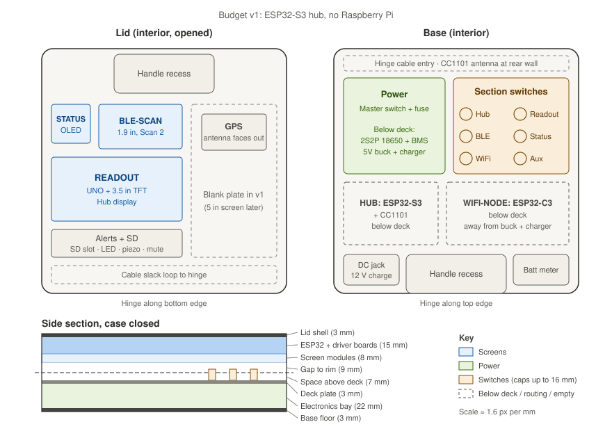

# Hardware layout

Physical layout plan for the cyberdeck: a portable, passive counter-surveillance station built into a 22 × 22 cm clamshell case. Scan modules each run on their own screen in the lid, a hub coordinates them, and the base holds power, switching and the RF hardware.

The build is in two phases:

| Phase | Hub | Status |
|---|---|---|
| **Budget v1 (current)** | ESP32-S3-DevKitC-1 N16R8, using the 3.5" screen as its display | Parts in the nde3d cart, 2026-10-09 |
| **Later upgrade** | Raspberry Pi 5 + 5" display + USB hub + SDR | Deferred on cost; nde3d doesn't stock any of it |



> The drawing shows the later Pi phase. In budget v1 the 5" slot in the lid and the Pi / USB hub bays under the deck stay empty.
>
> All dimensions are approximate planning figures. Measure the case interior and check every part against its datasheet before cutting anything.

---

## 1. Case

| Property | Value |
|---|---|
| Outer footprint | ~220 × 220 mm |
| Total height (closed) | ~70 mm |
| Depth per half | ~35 mm (lid and base are equal) |
| Handle recess | Top-centre of lid and front-centre of base, ~90 × 35 mm each |
| Hinge | Rear edge, full width |
| Anchor points | Moulded centre boss in each half |

**Usable interior per half:** roughly 205 × 165 mm once the handle recess and wall thickness are taken off.

---

## 2. Lid: displays and I/O

| Zone | Approx. size | Budget v1 | Later (Pi phase) |
|---|---|---|---|
| Top-left | 35 × 35 mm | 128×64 OLED + ESP32-C3: Scan 3, status/counters | Same |
| Top-middle | 55 × 40 mm | ESP32-1732S019 (built-in 1.9" 170×320): Scan 2, BLE trackers | Same |
| Middle-left | 85 × 56 mm | Arduino UNO + 3.5" TFT shield: **hub display**, fed by the S3 | Scan 1: main scan view |
| Bottom-left | ~117 × 22 mm | microSD shield slot, alert LED + piezo, mute button | Port panel: USB-A, USB-C, microSD |
| Right | ~77 × 121 mm | Empty (blank plate). GPS module mounts here, patch antenna facing out | 5" hub display, portrait |
| Hinge edge | ~25 mm strip | Cable slack zone | Same |

**Mounting:** a 3 mm faceplate with cut-outs for each screen, screwed to the lid's centre boss plus 4 corner standoffs (M3 nylon kit). Use acrylic or a 3D print, **not aluminium**: the ESP32 antennas sit behind the plate and metal would shield them.

**To measure before cutting:**
- The ESP32-1732S019 board outline against the 55 × 40 mm zone; the board is longer than its screen.
- The UNO + shield stack height. It is roughly 25–30 mm against the 23 mm lid budget in §4. It closes over the power zone, so keep that part of the deck clear.
- Feed the UNO through its 5 V pin. A USB-B plug won't fit behind the faceplate.

---

## 3. Base: power, switching and compute

### Top layer (deck plate)

| Zone | Contents |
|---|---|
| Rear strip | Hinge cable entry; CC1101 antenna (later: SMA jacks through the wall) |
| Left (green) | Power zone: master switch + panel fuse holder on top |
| Right (yellow) | Section switch panel: 6 mini toggles |
| Front-left pocket | Charge input: 5.5 × 2.1 mm DC jack (12 V in) |
| Front-centre | Handle recess (keep clear) |
| Front-right pocket | Battery capacity indicator (2S) |

### Below deck (electronics bay)

| Location | Budget v1 | Later (Pi phase) |
|---|---|---|
| Under power zone | 2S2P 18650 pack in a 4-cell holder, 2S BMS, 5 V buck, XL4015 charger | Same, plus a second buck for the lid rail |
| Under switch panel | Wiring only; keep ~15 mm clear for switch bodies | Same |
| Rear-left | ESP32-S3 hub + CC1101 | Raspberry Pi 5 (85 × 56 mm), low-profile cooling |
| Rear-right | ESP32-C3 WiFi node (headless) | Powered USB hub + SDR dongle |

Keep the CC1101 and the WiFi node away from the buck converter and the charger.

---

## 4. Depth budget (case closed)

When the case closes, the lid screens face down onto the deck, so both stacks must fit together.

| Layer | Thickness |
|---|---|
| Lid shell | 3 mm |
| ESP32 + driver boards | 15 mm |
| Screen modules | 8 mm |
| Gap to lid rim | 9 mm |
| *— split line —* | |
| Space above deck | 7 mm |
| Deck plate | 3 mm |
| Electronics bay | 22 mm |
| Base floor | 3 mm |
| **Total** | **~70 mm** |

The deck sits 3 mm higher than first drawn: an 18650 in a holder is about 21 mm tall and did not fit the original 19 mm bay.

**Rule:** switch caps + screen bezel protrusion must stay under ~16 mm combined, or the lid won't close.

---

## 5. Systems

### Power (budget v1)

```
12 V adapter ─► DC jack ─► XL4015 CC/CV (8.4 V, ~1 A) ─┐
                                                       ▼
18650 2S2P pack ◄─► 2S 20 A BMS ─► Fuse (8 A) ─► Master switch ─► 5 A buck (5.1 V) ─┬─► Hub (S3 + SD + CC1101 + GPS)
        │                                                                          ├─► Hub display (UNO + 3.5")
        └─► Capacity indicator (2S)                                                ├─► Scan 2 (ESP32-1732S019)
                                                                                   ├─► Scan 3 (C3 + OLED)
                                                                                   ├─► WiFi node (C3)
                                                                                   └─► Aux
```

- Load is about 1–1.5 A at 5 V, so the single buck runs everything. Runtime should be roughly 3–4 hours; measure it, because the cells are probably below their labelled 2200 mAh.
- Each branch has its own section switch so unused modules draw nothing.
- **Before connecting anything:** check the 4-cell holder with a multimeter and rewire it to 2S2P if it arrives as 4S (~15 V). Set the XL4015 to 8.4 V and the buck to about 5.1 V with no load.
- Charging is through the DC jack only. The single-cell USB-C charge/boost boards (IP5310, 5 V 2 A) **must never be connected to this pack**.
- The DC jack is rated 3 A; keep the XL4015 current limit at about 1 A.

**Pi phase changes:** the Pi 5 gets the 5 A buck to itself and the lid modules get a second buck. Add a momentary shutdown button on the Pi's power header (cutting power corrupts the SD card), set `usb_max_current_enable=1`, and confirm the master switch is rated 5 A DC or more.

### Section switch map

| Switch | Budget v1 | Later (Pi phase) |
|---|---|---|
| Master (power zone) | Everything, after the fuse | Same |
| 1 | Hub: S3 + SD + CC1101 + GPS | Pi 5 + 5" screen |
| 2 | Hub display: UNO + 3.5" TFT | Scan 1 |
| 3 | Scan 2: ESP32-1732S019 | Scan 2 |
| 4 | Scan 3: C3 + OLED | Scan 3 |
| 5 | WiFi node: C3 | RF/SDR: USB hub + SDR |
| 6 | Aux (spare) | Aux |

### Data (budget v1)

```
ESP32-C3 WiFi node ──UART──┐
ESP32-1732S019 (BLE) ─UART─┼─► ESP32-S3 hub ──row stream (one-way UART)──► UNO + 3.5" TFT
NEO-7M GPS ──────────UART──┘        │
                                    ├─ SPI: microSD shield (logging), CC1101 (433 MHz)
                                    └─ LED + piezo alerts, mute button
```

- All links are wired 3.3 V UART; nodes are receive-only radios. Framing is `v2/shared/deck_link.h`. S3 pins follow section 3.1 of [`PCB-BOM-AND-NETLIST.md`](PCB-BOM-AND-NETLIST.md).
- The hub display reuses the `R<rr><c><text>` row-stream protocol from `v2/proto_readout_c3` / `proto_readout_uno`; the S3 takes over the sender role from the C3.
- The S3 has three hardware UARTs, all used as receivers above. Scan 3 (C3 + OLED) therefore runs standalone in v1.
- Put a ~1 kΩ series resistor on each UART line between separately switched modules, so a powered board can't back-feed an unpowered one through its I/O pins.
- The CH340E USB-TTL adapter is a bring-up tool: it captures C3 serial output (C3 USB-CDC capture has been unreliable) and later connects the GPS to the Pi.

**Pi phase changes:** the ESP32s connect to the Pi over USB serial through a powered hub. A board on the hub is powered through its USB cable, so section switches must then switch each cable's VBUS line (or use a hub with per-port switches) rather than a separate 5 V feed.

### RF and antennas

- Everything is passive receive. No deauth, injection or jamming.
- CC1101 (433 MHz) uses its spring antenna or an IPEX lead to the rear wall.
- GPS patch antenna faces out of the lid, away from the buck and charger.
- Later: SMA bulkhead jacks for the SDR. Fit them to a side wall if antennas would foul the open lid.
- Optional: copper tape shield over the buck converter.

### Thermal

Budget v1 needs no cooling. For the Pi phase the official active cooler is borderline in the bay; use a low-profile heatsink case or mount the Pi on the floor with the cooler through a deck cut-out, and cut a small vent grille near it.

---

## 6. Cable routing across the hinge

Only these should cross the hinge:

1. Switched 5 V feeds and ground to the lid modules
2. UART lines (BLE node → hub, hub → display)
3. GPS, SD and alert wiring, if those sit in the lid

Use the 10 mm mesh sleeve, leave a slack loop in the lid's hinge strip, and strain-relieve both ends. SPI to the SD shield is the one fast bus; keep that run short or mount the shield in the base.

---

## 7. Parts list

### 7.1 On hand

| Part | Role |
|---|---|
| Arduino UNO R3 + 3.5" 480×320 TFT shield | Hub display |
| ESP32-1732S019 (ESP32 + 1.9" ST7789) | Scan 2, BLE |
| ESP32-C3 ×2 | WiFi node; Scan 3 |
| 128×64 OLED | Scan 3 |
| Active/passive buzzers, LEDs, 12 mm push buttons | Alerts and mute |
| Master switch (toolbox spare) | Check rating before the Pi phase |
| Second UNO, breadboards, jumpers, resistors | Bring-up |

### 7.2 nde3d cart (2026-10-09)

| Part | Qty | Price | Role |
|---|---|---|---|
| [ESP32-S3-DevKitC-1 N16R8](https://nde3d.co.za/esp-devices/3511-esp32-s3-n16r8-devkitc-development-board-with-wireless-53-16mb-flash-8mb-ram-type-c-usb.html) | 1 | R188.86 | Hub |
| [CC1101 433 MHz, IPEX](https://nde3d.co.za/rf-modules/2959-433mhz-cc1101-wireless-rf-transceiver-module.html) | 1 | R114.00 | Sub-GHz receive |
| [GY-NEO-7M GPS](https://nde3d.co.za/rf-modules/3191-gy-neo-7m-gps-active-ceramic-antenna-module.html) | 1 | R136.48 | Position and time |
| [Micro TF/SD shield for D1 Mini](https://nde3d.co.za/modules/779-micro-tfsd-card-shield-for-d1-mini.html) | 1 | R24.00 | Logging |
| [CH340E Type-C USB-TTL](https://nde3d.co.za/interface-converters/971-ch340e-micro-usb-to-ttl-serial-converter-5v33v.html) | 1 | R42.00 | Bring-up; GPS to Pi later |
| [18650 2200 mAh Li-ion](https://nde3d.co.za/consumables/2977-37v-18650-1500mah-lithium-ion-battery.html) | 4 | R317.60 | 2S2P pack |
| [18650 holder ×4 with wires](https://nde3d.co.za/battery-holders/2635-18650-battery-holder-x4-with-wires.html) | 1 | R16.00 | Pack; rewire to 2S2P |
| [2S 20 A BMS](https://nde3d.co.za/interface-converters/2777-2s-20amp-battery-management-circuit-bms.html) | 1 | R75.00 | Protection + balancing |
| [5 A 75 W step-down module](https://nde3d.co.za/power-supplies/2428-5a-75w-dc-dc-high-power-adjustable-step-down-stabilized-voltage-supply-module.html) | 1 | R118.00 | 5 V rail |
| [XL4015 5 A CC/CV](https://nde3d.co.za/power-supplies/1258-5a-30v-adjustable-voltage-and-current-charger.html) | 1 | R66.00 | Charger, set to 8.4 V |
| [3 A 5.5 × 2.1 mm bulkhead DC connector](https://nde3d.co.za/plugs-sockets-connectors/2096-3a-55-x-21mm-bulkhead-male-dc-power-connector.html) | 1 | R4.67 | Charge input |
| [Fuse holder, 5×20 mm panel mount](https://nde3d.co.za/plugs-sockets-connectors/2499-fuse-holder-for-5x20mm-panel-mount.html) | 1 | R25.00 | Main fuse |
| [5×20 mm glass fuse 8 A](https://nde3d.co.za/fuses/2853-5-x-20mm-glass-fuse-250v-8a.html) | 5 | R15.00 | Main fuse + spares |
| [Miniature toggle SMTS-203 (DPDT)](https://nde3d.co.za/switches/2890-miniature-toggle-switch-on-off-on-smts-203-dpdt.html) | 6 | R84.00 | Section switches |
| [Capacity indicator board, 2S](https://nde3d.co.za/electronics/2574-12v-lithium-battery-power-indicator-board.html) | 1 | R58.00 | Battery meter |
| [Mesh nylon sleeve 10 mm × 1 m](https://nde3d.co.za/cable/3036-1-metre-flame-retardant-nylon-pet-mesh-telescopic-sleeve.html) | 1 | R7.00 | Hinge bundle |
| [M3 nylon standoff kit, 180 pcs](https://nde3d.co.za/bolts-nuts/3354-sdafasdf.html) | 1 | R98.78 | Mounting |
| **Total** | | **R1,390.39** | |

Also in the cart but **not used in this build** (single-cell boards, R116): IP5310 Type-C 3 A charge/boost module ×1, 5 V 2 A charge/boost module ×2.

### 7.3 Still needed for budget v1

- 12 V DC adapter with a 5.5 × 2.1 mm plug, 1 A or more
- 3 mm acrylic or printed faceplate and deck plate
- Hook-up wire (18–20 AWG for the power path), cable ties

### 7.4 Later (Pi phase, other suppliers)

| Part | Note |
|---|---|
| Raspberry Pi 5 + microSD + low-profile cooler | |
| 5" display, DSI touch preferred | Check outline against the 77 × 121 mm zone |
| Powered USB hub, 7+ ports | Per-port switches preferred |
| RTL-SDR, SMA bulkheads, pigtails, antennas | |
| Second 5 V buck | Lid rail |
| 2S USB-C charger module | Replaces DC-jack charging, optional |
| Shutdown push button | |
| nde3d: [USB-A panel extension](https://nde3d.co.za/plugs-sockets-connectors/1725-1mtr-usb-extension-cable-panel-mount-type-a.html) R33, [Type-C extension](https://nde3d.co.za/cable/3484-type-c-31-male-to-female-usb-extension-cable-with-screw-ear.html) R123, [microSD extender](https://nde3d.co.za/connectors/3513-microsd-card-extender.html) R84 | Port panel |

The Pi 5 has no 3.5 mm jack, so audio on the port panel would need a USB audio adapter.

---

## 8. Build order

- [ ] Measure the case interior precisely and update this doc
- [ ] Order the nde3d cart (§7.2)
- [ ] Make cardboard templates of the lid faceplate and base deck; test-fit with the case closed
- [ ] Build and test the power system on the bench: holder wiring, BMS, fuse, charger at 8.4 V, buck at 5.1 V, switches
- [ ] Bring up the S3 hub on the bench: SD, GPS, one node at a time, then the UNO display link
- [ ] Cut faceplate and deck plate; cut the DC jack and meter openings in the front pockets
- [ ] Mount the screens and modules; route the hinge bundle
- [ ] Full close test: confirm nothing touches when the lid shuts
- [ ] Walk test, log check, runtime measurement

---

## 9. Open questions

- Exact inner dimensions of each half
- Whether Scan 3 stays standalone or gets a link to the hub (the S3 is out of UARTs)
- Current rating of the SMTS-203 toggles (not in the listing); matters once a Pi draws 4–5 A through one
- Pi location when it arrives: base (as drawn) or behind the hub screen in the lid
